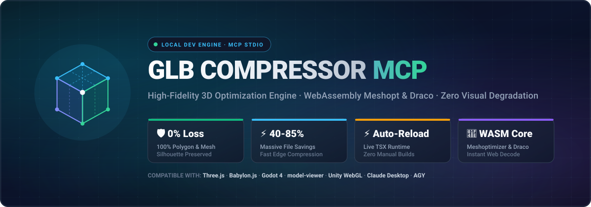

<p align="center">
  
</p>

# ⚡ GLB Compressor MCP Server

> High-fidelity 3D model compression and optimization Model Context Protocol (MCP) server with **zero visual quality degradation**. Deployable natively to **Cloudflare Workers** (Streamable HTTP / SSE) or locally as a stdio MCP server.

[](https://opensource.org/licenses/MIT)
[](https://workers.cloudflare.com/)
[](https://modelcontextprotocol.io/)

---

## 🌟 Highlights

- **🛡️ 100% Visual Quality Preservation:** Preserves silhouette, vertex attributes, polygons, and textures without destructive loss. Zero triangle loss by default.
- **⚡ Dual Runtime Support:**
  - **Cloudflare Workers Edge Server:** Operates serverless via WebAssembly Meshoptimizer, handling remote assets via URL or Base64 over Streamable HTTP and SSE (`/mcp`, `/sse`).
  - **Local Node.js Stdio Server:** Direct filesystem access for local batch folder compression and sharp texture encoding.
- **📦 Multi-format 3D Support:** Reads `.glb` and multi-file `.gltf` (with `.bin` and textures), consolidating and outputting highly optimized binary `.glb`.
- **🚀 Advanced Pipeline:**
  - Meshopt WebAssembly geometry compression (`EXT_meshopt_compression`)
  - Google Draco compression (`KHR_draco_mesh_compression`)
  - Duplicate vertex welding (`weld`)
  - Unused node, mesh, and buffer pruning (`prune`)
  - Accessor and texture deduplication (`dedup`)
  - Animation keyframe resampling (`resample`)
  - GPU vertex cache & fetch reordering (`reorder`)
  - High-fidelity WebP texture compression (`EXT_texture_webp`)

---

## 🌐 Remote Cloudflare Workers Endpoints

Replace `<your-subdomain>` with your Cloudflare Workers subdomain (e.g., `satyam420` or your account handle):

- **Base URL:** `https://glb-compressor-mcp.<your-subdomain>.workers.dev`
- **Streamable HTTP MCP Endpoint:** `https://glb-compressor-mcp.<your-subdomain>.workers.dev/mcp`
- **Legacy SSE Endpoint:** `https://glb-compressor-mcp.<your-subdomain>.workers.dev/sse`

---

## 🛠️ MCP Tools Overview

### 1. `compress_glb`
Compresses and optimizes a 3D model from a public URL or Base64 string with guaranteed geometry fidelity.
- **Arguments:**
  - `url` *(string, optional)*: Direct HTTP/HTTPS download link of `.glb`
  - `base64` *(string, optional)*: Base64 string of `.glb` data
  - `preset` *(enum)*: `"high_quality"` (default), `"lossless"`, `"balanced"`
  - `includeBase64Output` *(boolean, default: true)*: Returns Base64 of compressed GLB.

### 2. `inspect_glb`
Inspects 3D asset metadata without modifying it.
- **Arguments:**
  - `url` *(string, optional)*
  - `base64` *(string, optional)*
- **Outputs:** Polygon count, vertices, textures breakdown, animations, materials, and extensions used.

### 3. `compare_glb` *(Local Engine)*
Compares original vs compressed models to verify exact polygon counts and byte savings.

### 4. `batch_compress_glb` *(Local Engine)*
Recursively traverses a local folder to compress all `.glb` and `.gltf` files in-place or into `.compressed.glb`.

### 5. `convert_gltf_to_glb` *(Local Engine)*
Packs multi-file `.gltf` files with external `.bin` and image textures into a single self-contained optimized `.glb`.

---

## 🚀 Quick Start

### Installation

```bash
git clone https://github.com/satyamkumar420/glb-compressor-mcp.git
cd glb-compressor-mcp
pnpm install
```

### Build & Test

```bash
pnpm build
pnpm test
```

### Run Locally (Dev)

```bash
pnpm wrangler dev --port 8789
```

### Deploy to Cloudflare Workers

```bash
pnpm wrangler deploy
```

---

## ⚙️ Configuration in MCP Clients

### Claude Desktop / AGY / Custom MCP Clients

Add to your `mcp_config.json`:

```json
{
  "mcpServers": {
    "glb-compressor": {
      "url": "https://glb-compressor-mcp.<your-subdomain>.workers.dev/mcp"
    }
  }
}
```

---

## ☕ Support & Sponsor

If you find **GLB Compressor MCP** helpful and want to support its maintenance:

<div align="center">

<a href="https://buymeacoffee.com/satyam404" target="_blank">
  
</a>

<br/><br/>

<a href="https://buymeacoffee.com/satyam404" target="_blank">
  
</a>

<br/>

<sub>Scan the QR code or click the button above to buy me a coffee! Thank you for your support! ☕✨</sub>

</div>

---

## 👤 Author

**Satyam Kumar**
- GitHub: [@satyamkumar420](https://github.com/satyamkumar420)
- LinkedIn: [satyamkumar404](https://www.linkedin.com/in/satyamkumar404/)
- Portfolio: [satyam404.vercel.app](https://satyam404.vercel.app)

## 📄 License

MIT License. See [LICENSE](LICENSE) for details.
